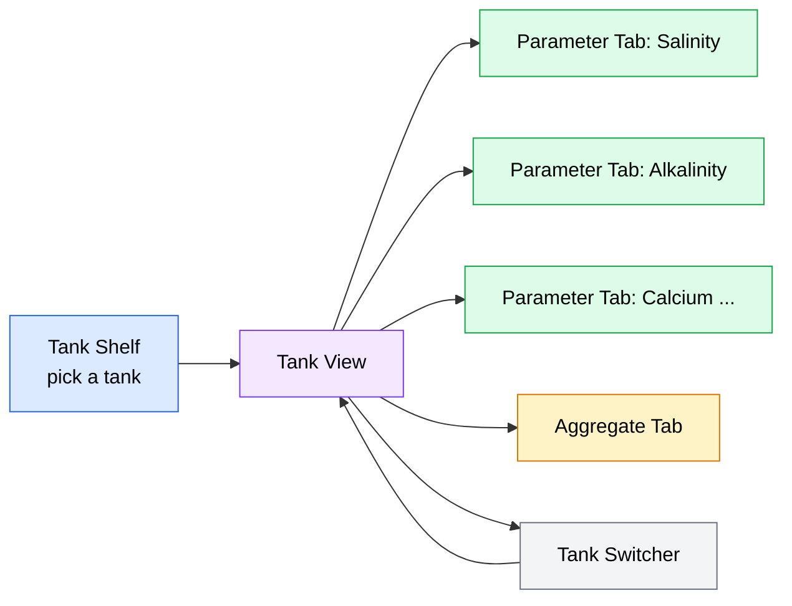
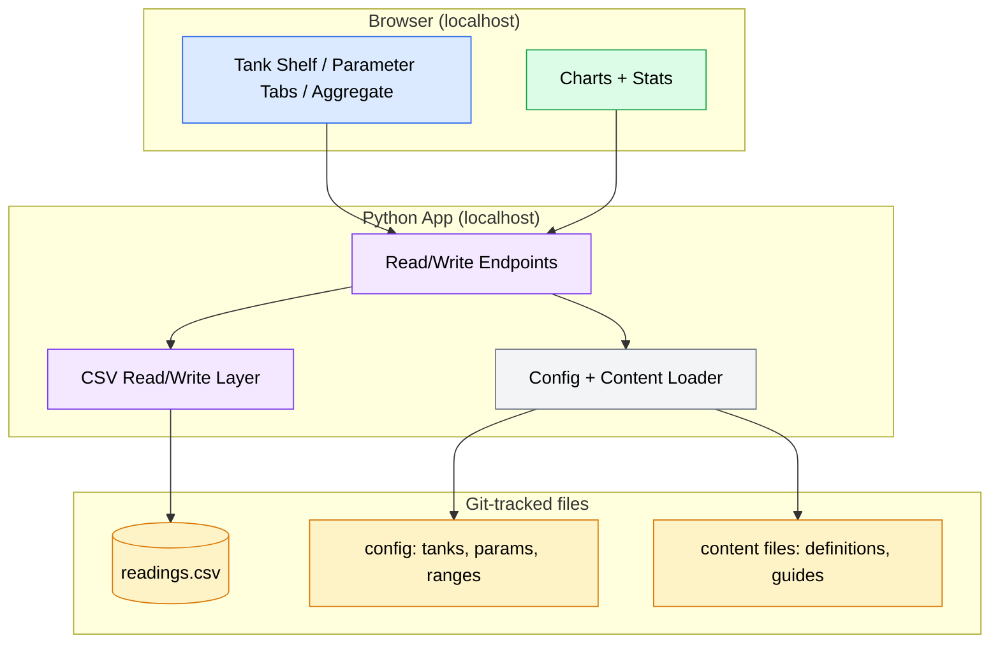

# fishy PRD

**Version**: 1.0
**Author**: Anthony Prancl
**Date**: 2026-07-01
**Status**: Draft
**Spec Type**: New product
**Spec Depth**: Detailed specifications
**Description**: A personal, local-first web app for reef aquarists to log dated water-parameter readings and see them through beautiful, useful visualizations. Data lives in a git-trackable CSV; the app runs on localhost and reads/writes that file as its only state. Deliberately narrow scope — track water parameters and visualize them, done well — with a fun, tropical-reef look and feel.

---

## 1. Executive Summary

**fishy** is a single-user, local-first "water-parameter notebook" for reef-tank keepers. You run it on localhost, pick a tank, and flip through per-parameter tabs where you log a reading, see it plotted over time against its ideal range, and read what the parameter means and what to do if it drifts. All data persists to a plain-text CSV that can be committed to git — no accounts, no cloud, no database server. The experience should be delightful and unmistakably tropical-reef, not a spreadsheet.

## 2. Problem Statement

### 2.1 The Problem

Reef aquarists must monitor a handful of interdependent water parameters (salinity, alkalinity, calcium, magnesium, phosphate, and others) to keep fish and coral healthy. Readings are typically scattered across paper notebooks, generic spreadsheets, or heavyweight apps that are cloud-locked, ad-supported, or bloated with features the keeper doesn't want. There is no simple, personal, *ownable* way to record dated readings and immediately *see* the trend and know whether a value is in range.

### 2.2 Current State

- **Paper / whiteboard**: no trends, easy to lose, no history.
- **Generic spreadsheets**: manual charting, no target-range awareness, no reference/action guidance, ugly.
- **Commercial aquarium apps**: require accounts, push toward cloud sync and social features, may cost money or show ads, and are not scoped to "just parameters." The data is not the user's plain-text file.

None of these give the keeper a beautiful, focused, local, git-versioned parameter log.

### 2.3 Impact Analysis

When parameter drift goes unseen, coral loses color, growth stalls, or livestock dies — expensive and disheartening losses. The cost of *not* solving this is inconsistent logging (the keeper stops tracking because it's tedious/ugly) and reactive rather than proactive husbandry. The value here is qualitative and personal: a tool the keeper *wants* to open keeps the habit alive, and consistent data makes problems visible before they become losses.

### 2.4 Business Value

This is a personal tool, not a commercial product; "business value" is personal value. Success is a maintainable, delightful notebook the author (and anyone who clones it) actually uses. Keeping the scope narrow and the stack minimal ensures it stays easy to run and easy to reason about for years, with data safely versioned in git.

## 3. Goals & Success Metrics

### 3.1 Primary Goals

1. **Effortless logging** — recording a reading for any parameter takes seconds, with the date captured automatically.
2. **Instant insight** — every parameter shows its trend over time against its ideal range, plus at-a-glance stats, so the keeper immediately knows where things stand.
3. **Teach & guide** — each parameter tab explains what it is, how it's measured, what happens when it drifts, and how to correct it.
4. **Own your data** — all state lives in a human-readable, git-trackable CSV; the app is just a friendly read/write layer over it.
5. **Delight** — a fun, tropical-reef aesthetic that makes the keeper *want* to open it.

### 3.2 Success Metrics

| Metric | Current Baseline | Target | Measurement Method | Timeline |
|--------|------------------|--------|-------------------|----------|
| Consistent personal logging | None (no tool) | Keeper logs readings regularly and keeps history current | Self-observed usage; commits to the data CSV over time | Ongoing after v1 |
| Time to log one reading | ~minutes (spreadsheet) | < 15 seconds from tab to saved | Manual walkthrough of the add-reading flow | v1 |
| Out-of-range awareness | Manual judgment | Every out-of-range value is visually obvious without thinking | Visual review of parameter and aggregate views | v1 |
| "Do I want to open it?" | N/A | Yes — the tool feels fun, not a chore | Subjective author judgment | v1 |

### 3.3 Non-Goals

- Not a multi-user / hosted SaaS product.
- Not a full aquarium manager (no livestock inventory, feeding logs, dosing automation, or reminders in v1).
- Not a cloud-sync or multi-device solution — sharing/backup is via git.
- Not a scientific analytics suite — visualizations should be *pretty and useful*, not exhaustive statistical tooling.

## 4. User Research

### 4.1 Target Users

#### Primary Persona: The Reef Keeper (the author)

- **Role/Description**: A hobbyist reef aquarist running one or more saltwater tanks, comfortable running a local app and using git.
- **Goals**: Keep a personal, dated log of water parameters; see trends at a glance; know when something is out of range and what to do about it; own the data.
- **Pain Points**: Existing tools are cloud-locked, ugly, or overloaded; spreadsheets don't teach or guide; paper has no trends.
- **Context**: Tests water tankside or at a workbench, then logs the reading on a laptop/desktop on localhost. Uses it repeatedly over weeks and months.

#### Secondary Persona: The Cloner

- **Role/Description**: Anyone who clones the repo and runs fishy for their own tanks.
- **Goals**: Same as above — a simple local parameter notebook they can run and version themselves.
- **Pain Points**: Wants something they can stand up quickly with a single command and no external services.

### 4.2 User Journey Map

```
[Test water] --> [Open fishy on localhost] --> [Pick tank] --> [Open parameter tab]
     --> [Enter value (date auto-captured)] --> [See trend vs. ideal range + stats]
     --> [Read what to do] --> [Optionally open Aggregate tab for the whole picture]
     --> [Commit data.csv to git]
```

Typical flow: the keeper tests, say, alkalinity; opens the **Alkalinity** tab; types `7.1` and saves; the chart adds today's point, the range band shows it's low, the stat card flags it and the trend arrow points down; the action guide suggests dosing/adjusting; later the keeper glances at the **Aggregate** tab to see everything in one place, then commits the updated CSV.

### 4.3 Screen / Navigation Model



## 5. Functional Requirements

> Priorities: **P0** = required for a usable v1; **P1** = important, ships in v1 if feasible; **P2** = polish/nice-to-have.

### 5.1 Feature: Tank Shelf & Tank Switcher

**Priority**: P0 (Critical)

#### User Stories

**US-001**: As a reef keeper, I want to see a shelf of my labeled tanks on launch and click into one, so that I can work with that tank's data.

**US-002**: As a reef keeper, I want to switch the active tank from anywhere in the app, so that all pages show the selected tank's data.

**Acceptance Criteria**:
- [ ] On launch, the app shows a landing "shelf" listing all configured tanks by label.
- [ ] Selecting a tank opens the Tank View scoped to that tank.
- [ ] A persistent tank switcher lets the user change the active tank; all parameter and aggregate views update to the selected tank.
- [ ] The set of tanks is read from configuration (see §7.5); adding a tank in config makes it appear on the shelf without code changes.
- [ ] The currently active tank is clearly indicated in the UI.

**Edge Cases**:
- No tanks configured: show a friendly empty state explaining how to add a tank in the config file.
- One tank configured: shelf still works; app may open directly or show the single tank.
- Tank with zero readings: Tank View loads with empty charts and helpful empty states.

---

### 5.2 Feature: Log a Reading (per-parameter web form)

**Priority**: P0 (Critical)

#### User Stories

**US-003**: As a reef keeper, on a given parameter's tab, I want to enter a value and save it with the date captured automatically, so that logging is fast and I never have to type the date.

**US-004**: As a reef keeper, I want to optionally attach a free-text note to a reading, so that I can record context (e.g., "dosed 5ml, 10% water change").

**Acceptance Criteria**:
- [ ] Each parameter tab has an "Add reading" form scoped to that single parameter (not a grid of all parameters).
- [ ] The reading's date is captured automatically at save time; the user does not have to enter it. The captured date is editable/overridable before saving (for back-dating a test).
- [ ] A reading requires a numeric value and optionally accepts a free-text note.
- [ ] Saving appends a new row to the data CSV and the view updates immediately to include the new reading (chart point, stats, table).
- [ ] Partial logging is first-class: logging one parameter never requires entering any other parameter.
- [ ] Invalid input (non-numeric value, empty value) is rejected with a clear, friendly message and nothing is written.

**Edge Cases**:
- Multiple readings for the same parameter on the same day: all are stored (data is one-row-per-reading) and all appear in history.
- Value entered in a non-default unit (e.g., salinity in ppt vs. specific gravity): see §5.6 units handling; the stored value records its unit or is normalized consistently.
- Note containing commas/quotes/newlines: written safely via proper CSV quoting so the file stays valid.

---

### 5.3 Feature: Parameter Tab — Visualizations & Stats

**Priority**: P0 (Critical)

#### User Stories

**US-005**: As a reef keeper, I want each parameter tab to show my readings as a beautiful time-series chart with the ideal range shaded, so that I can see trend and whether I'm in range at a glance.

**US-006**: As a reef keeper, I want a stats summary (latest value, trend, min/max/avg, days since last reading), so that I understand current state instantly.

**Acceptance Criteria**:
- [ ] Each parameter tab renders a time-series line chart of that parameter's readings over time for the active tank.
- [ ] The chart displays a shaded target/safe-range band for the parameter (from defaults or overrides, see §5.5).
- [ ] Readings that fall outside the target range are visually distinguished on the chart (e.g., highlighted points).
- [ ] A stats area shows: latest value, trend direction vs. previous reading(s), min/max/average over the visible history, and days since the last reading.
- [ ] The latest value shows an in-range / out-of-range badge.
- [ ] Empty state: with no readings, the tab shows a friendly prompt to log the first reading instead of a broken/empty chart.

**Edge Cases**:
- Single reading: chart shows one point and stats degrade gracefully (no trend, min=max=avg=value).
- Large history: chart remains readable (reasonable downsampling or scrolling/zoom is acceptable).
- All readings out of range: highlighting and badges still render correctly.

---

### 5.4 Feature: Parameter Tab — Reference & Action Guide

**Priority**: P1 (High)

#### User Stories

**US-007**: As a reef keeper, I want each parameter tab to explain what the parameter is, how it's measured, its ideal range, what happens if it drifts too high or too low, the signs to watch for, and suggested remedies, so that logging doubles as learning and I know what action to take.

**Acceptance Criteria**:
- [ ] Each built-in parameter tab shows curated content: a **definition** (e.g., salinity = the salt content of the water), the **units/measurement methods** and what they mean (e.g., specific gravity vs. ppt), the **ideal range**, the **consequences** of going too high and too low (effects on fish and coral), the **signs/symptoms** to watch for, and **suggested remedies**.
- [ ] This content is sourced from editable content files shipped with defaults, so the keeper can tweak wording or add their own (see §7.5, "Content Source").
- [ ] A user-defined custom parameter gets a fillable content template (blank sections) the keeper can complete; missing sections render as gentle placeholders rather than errors.
- [ ] Reference content is presented in a clean, readable layout alongside (not obscuring) the charts and stats.

**Edge Cases**:
- Content file missing or partially filled: the tab still renders; only the present sections show, with placeholders for the rest.
- Content file with formatting (markdown): rendered readably.

---

### 5.5 Feature: Target Ranges (defaults + overrides)

**Priority**: P1 (High)

#### User Stories

**US-008**: As a reef keeper, I want sensible reef target ranges built in, but the ability to override them per parameter (and per tank), so that highlighting matches my system.

**Acceptance Criteria**:
- [ ] The app ships with sensible default reef target ranges for each built-in parameter.
- [ ] The keeper can override a target range per parameter via configuration.
- [ ] Overrides can be specified per tank (a tank without an override falls back to the default).
- [ ] Target ranges drive both the shaded band on charts and the in/out-of-range highlighting everywhere (parameter tabs and aggregate).

**Edge Cases**:
- Only a lower or only an upper bound defined: highlighting applies to whichever bound(s) exist.
- Custom parameter with no range defined: no band/highlighting shown, but data still plots.
- Invalid range config (min > max): surfaced as a clear config warning; app still runs.

---

### 5.6 Feature: Parameters & Units

**Priority**: P1 (High)

#### User Stories

**US-009**: As a reef keeper, I want the core reef parameters built in and the ability to define my own custom parameters, so that I can track exactly what I care about.

**US-010**: As a reef keeper, I want parameters that have multiple common units (e.g., salinity as specific gravity or ppt) to be handled clearly, so that my data stays consistent and understandable.

**Acceptance Criteria**:
- [ ] Built-in reef parameters include at minimum: **Salinity / Specific Gravity**, **Alkalinity (dKH)**, **Calcium**, **Magnesium**, **Phosphate**.
- [ ] The keeper can define additional custom parameters (name, unit, optional target range) via configuration without code changes.
- [ ] Each parameter declares its unit; the UI labels values and axes with that unit.
- [ ] For parameters with multiple common measurement methods, the reference content explains them, and the stored data records values in a single consistent unit per parameter (documented behavior; conversion, if any, is defined explicitly).

**Edge Cases**:
- Two parameters with the same display name: disambiguated by a stable key/id.
- Removing a parameter from config that still has readings in the CSV: those readings remain in the file and are handled gracefully (e.g., shown under an "unknown/archived parameter" section or ignored with a note) rather than crashing.

---

### 5.7 Feature: Aggregate ("Group") Tab

**Priority**: P0 (Critical)

#### User Stories

**US-011**: As a reef keeper, I want one combined page that tells the whole story of the active tank — current state, trends across parameters, and full history — so that I can review everything in one place.

**Acceptance Criteria**:
- [ ] The Aggregate tab is a single scrolling page composed, top to bottom, of three sections:
  1. **Cards row** — one stat-card per parameter (latest value, trend arrow, in/out-of-range badge).
  2. **Overlay chart** — all parameters plotted over a shared timeline (normalized or multi-axis so differing scales are comparable), with the ability to toggle individual parameter lines.
  3. **History table** — the full reading history, **one row per reading**, columns showing date, parameter, value, and note.
- [ ] The history table shows partial days naturally: a reading only appears where it was actually logged; unlogged parameters are simply absent for that reading (no forced grid).
- [ ] Out-of-range values are highlighted in the cards, on the overlay chart, and in the table.
- [ ] The entire Aggregate tab is scoped to the active tank (no cross-tank comparison in v1).
- [ ] The history table supports a sensible default view with the ability to see all history (e.g., ordered most-recent-first).

**Edge Cases**:
- Tank with no readings: all three sections show friendly empty states.
- Parameters on very different scales: overlay normalization keeps the chart legible; a legend clarifies each line.
- Very long history: table remains usable (ordering, and scrolling/pagination acceptable).

---

### 5.8 Feature: CSV Persistence & Git-Friendliness

**Priority**: P0 (Critical)

#### User Stories

**US-012**: As a reef keeper, I want all my data stored in a human-readable CSV that I can commit to git, so that I own my data and can see per-reading diffs in version control.

**Acceptance Criteria**:
- [ ] All readings persist to a plain-text CSV in a stable, documented long/tidy schema (see §7.4): one row per reading.
- [ ] The CSV is the single source of truth for reading state; the app reads it on load and appends on save.
- [ ] Writes preserve a stable column order and formatting so that git diffs show only the rows that actually changed (append-only for new readings).
- [ ] The CSV remains valid when notes contain commas, quotes, or newlines (proper CSV quoting).
- [ ] Hand-edits to the CSV (adding/removing/correcting rows in a text editor) are respected by the app on next load, as long as the schema is followed.

**Edge Cases**:
- Missing data file on first run: app creates it (with header) or shows a clear first-run state.
- Malformed row in the CSV: app surfaces a clear, non-fatal warning identifying the row rather than crashing, and loads the valid rows.
- Concurrent edit (file changed on disk while app is running): documented behavior — app reads current file state on load/save; last-write semantics are defined and safe (no silent data loss of existing rows).

## 6. Non-Functional Requirements

### 6.1 Performance

- App launches and renders the tank shelf quickly on a typical laptop (sub-second to a couple of seconds).
- Logging a reading and seeing it reflected in the UI feels instant (< ~250 ms perceived after save).
- Handles years of personal readings (thousands of rows) without noticeable lag in load or chart render.

### 6.2 Security

- **No authentication/authorization** — single local user, runs on localhost only; not exposed to a network by default.
- No secrets, no external calls, no telemetry. All data stays on the local machine and in the repo.
- The server binds to localhost by default so it is not reachable from other machines.

### 6.3 Scalability

- Scope is intentionally single-user/local; "scale" means gracefully handling many tanks, many parameters, and long histories in one CSV, not concurrent users.

### 6.4 Accessibility

- Sufficient color contrast for text and for the tropical-reef palette; out-of-range status is conveyed by more than color alone (e.g., icon/badge/label) so it's distinguishable regardless of color perception.
- Keyboard-usable forms and navigation; sensible focus order.
- Readable typography and reasonable responsive behavior on desktop and mobile-width browser windows.

### 6.5 Aesthetic & Experience (first-class requirement)

- **Tropical-reef** visual identity: bright, warm, lively palette and playful marine motifs; the app should feel fun and wonderful, not utilitarian.
- Charts are beautiful and legible; the aesthetic never compromises readability of data or out-of-range signals.
- Delightful empty states, friendly copy, and smooth transitions where they add joy without hurting performance.

## 7. Technical Considerations

### 7.1 Architecture Overview

fishy is a minimal local Python web app. A small backend (Python web framework) serves the UI and exposes read/write operations over a single CSV data file plus a configuration/content layer. The frontend renders tank shelf, parameter tabs (charts + stats + reference/action content), and the aggregate page. There is no database server and no external service; the CSV is the entire persistent state for readings, and config/content files define tanks, parameters, ranges, and reference material.



### 7.2 Tech Stack

- **Backend**: Python with a lightweight web framework (e.g., **Flask** or **FastAPI**) — minimal dependencies, single command to run.
- **Frontend**: Server-rendered pages and/or a light JS layer, with a charting library capable of shaded range bands, multi-series overlays, and an attractive look (e.g., Plotly, Chart.js, or similar). Choice made in Phase 1.
- **Storage**: Plain-text **CSV** for readings; human-editable config and content files for tanks/parameters/ranges and reference material.
- **Infrastructure**: None — runs locally on localhost; no DB server, no cloud, no external APIs.

> **Decision to confirm in Phase 1:** exact web framework (Flask vs. FastAPI) and charting library. Selection criteria: minimal footprint, easy single-command run, and attractive charts supporting range bands + overlays.

### 7.3 Integration Points

| System | Integration Type | Purpose |
|--------|-----------------|---------|
| Local filesystem | File read/write | Persist and load readings CSV, config, and content files |
| git (external, manual) | Version control of data files | Backup, history, and per-reading diffs — performed by the user, not the app |

No third-party or network integrations in v1.

### 7.4 Data Model — CSV Schema (long/tidy format)

Readings are stored one row per reading in **long/tidy** form, which cleanly supports partial logging and user-defined parameters (adding a parameter never changes the columns).

Proposed columns for `readings.csv` (exact names finalized in Phase 1):

| Column | Type | Description |
|--------|------|-------------|
| `tank` | string (key) | Stable tank identifier/label the reading belongs to |
| `parameter` | string (key) | Stable parameter identifier (built-in or custom), e.g. `salinity`, `alkalinity` |
| `date` | date/datetime | Auto-captured at save time (editable before save); when the reading was taken |
| `value` | number | The measured value, in the parameter's declared unit |
| `unit` | string | The unit the value is expressed in (supports parameters with multiple methods) |
| `note` | string (optional) | Free-text note; CSV-quoted to remain valid with commas/quotes/newlines |

Example:

```
tank,parameter,date,value,unit,note
reef-a,salinity,2026-06-28,1.026,sg,
reef-a,alkalinity,2026-06-29,7.9,dKH,"algae starting, watch it"
reef-a,phosphate,2026-06-29,0.08,ppm,
reef-a,alkalinity,2026-07-01,7.1,dKH,"dosed, 10% water change"
```

**Configuration & content layer** (separate git-tracked files, format finalized in Phase 1 — e.g. YAML/JSON/TOML for config, markdown for content):

- **Tanks**: list of tanks with stable id + display label.
- **Parameters**: built-in and custom parameter definitions (id, display name, unit(s), default target range).
- **Target ranges**: default per parameter, with optional per-tank overrides.
- **Content**: per-parameter reference/action-guide files (definition, measurement methods, consequences of high/low, signs, remedies) — shipped with defaults, user-overridable; custom parameters get a fillable template.

### 7.5 Technical Constraints

- **Minimalism**: keep dependencies and moving parts as few as possible; the app must be easy to run and understand.
- **Localhost-only**: bind to localhost; no network exposure or auth in v1.
- **Git-friendly writes**: append-only for new readings; stable column order/formatting so diffs are clean and meaningful.
- **File is source of truth**: no hidden state; hand-editing the CSV/config is a supported workflow.
- **Human-readable everything**: readings, config, and content are all plain-text and diffable.

## 8. Scope Definition

### 8.1 In Scope

- Tank shelf + tank switcher (multiple tanks, active-tank scoping).
- Per-parameter tabs with: time-series chart + shaded target range + out-of-range highlighting + stats (latest, trend, min/max/avg, days-since-last).
- Per-parameter reference & action-guide content (definition, units/methods, consequences of high/low, signs, remedies) from editable content files with shipped defaults.
- Per-parameter web form to log a reading with **auto-captured (editable) date**, numeric value, optional note; partial logging first-class.
- Built-in reef parameters (salinity/SG, alkalinity dKH, calcium, magnesium, phosphate) plus user-defined custom parameters.
- Target ranges: sensible reef defaults with per-parameter and per-tank overrides.
- Aggregate tab: combined single page = cards row + all-parameter overlay chart + full history table (one row per reading), scoped to the active tank.
- CSV persistence (long/tidy schema) with git-friendly, safely-quoted writes; config + content files.
- Tropical-reef aesthetic; runs on localhost via a simple launch.

### 8.2 Out of Scope

- **Accounts / authentication**: single local user — no login needed.
- **Cloud / hosting / multi-device sync**: local + git only.
- **Reminders / notifications / scheduling**: no maintenance alerts in v1.
- **Livestock / feeding / inventory tracking**: parameters only in v1.
- **Cross-tank comparison in the aggregate view**: one tank at a time in v1.
- **Automated dosing or equipment control**: not a controller.

### 8.3 Future Considerations

- Cross-tank comparison / overlay of the same parameter across tanks.
- Maintenance reminders and a light activity log (water changes, dosing) tied to readings.
- Import/export helpers (e.g., importing an existing spreadsheet).
- Richer analytics (correlations between parameters, rate-of-change alerts).
- Optional SQLite backend if the CSV ever outgrows its usefulness (retaining an export-to-CSV path for git).
- Livestock/coral inventory as a separate, opt-in module.

## 9. Implementation Plan

### 9.1 Phase 1: Foundation
**Completion Criteria**: The data and config layer exists and round-trips; the app runs on localhost and can read tanks/parameters and read/write readings to the CSV.

| Deliverable | Description | Dependencies |
|-------------|-------------|--------------|
| Stack decision | Choose web framework (Flask/FastAPI) and charting library; document rationale | None |
| CSV schema + read/write layer | Implement long/tidy `readings.csv` read/append with safe quoting and stable formatting | Stack decision |
| Config + content loader | Define config format for tanks/parameters/ranges and content-file convention; load them | Stack decision |
| App skeleton + localhost run | Single-command launch serving a basic page; localhost binding | Stack decision |

**Checkpoint Gate**: Review and approve the CSV schema, config/content file formats, and chosen stack **before** building UI/features.

---

### 9.2 Phase 2: Core Features
**Completion Criteria**: The keeper can pick a tank, open a parameter tab, log a reading (auto-date), and see it plotted against its range with stats.

| Deliverable | Description | Dependencies |
|-------------|-------------|--------------|
| Tank shelf + switcher | Landing shelf of tanks; active-tank scoping across the app | Phase 1 |
| Add-reading form | Per-parameter form with auto-captured/editable date, value, optional note; append to CSV; partial logging | Phase 1 |
| Parameter tab: chart + range band | Time-series chart with shaded target range and out-of-range point highlighting | Phase 1 |
| Parameter tab: stats | Latest value + badge, trend, min/max/avg, days-since-last | Add-reading form |

**Checkpoint Gate**: Review the add-reading UX and parameter-tab visualization (correctness of ranges/highlighting and clarity of stats) before layering reference content and the aggregate view.

---

### 9.3 Phase 3: Reference, Ranges & Aggregate
**Completion Criteria**: Parameter tabs teach and guide; ranges are configurable with defaults+overrides; the aggregate page tells the whole-tank story.

| Deliverable | Description | Dependencies |
|-------------|-------------|--------------|
| Reference & action-guide content | Curated, editable content per built-in parameter; fillable template for custom params | Phase 2 |
| Target ranges: defaults + overrides | Ship reef defaults; per-parameter and per-tank overrides drive bands/highlighting | Phase 2 |
| Custom parameters | User-defined parameters via config (name, unit, optional range) | Phase 2 |
| Aggregate tab | Combined page: cards row + overlay chart (toggle lines) + full history table (one row per reading) | Phase 2 |

**Checkpoint Gate**: Review the aggregate page layout and the reference-content model before final polish.

---

### 9.4 Phase 4: Tropical-Reef Polish
**Completion Criteria**: fishy looks and feels fun and wonderful, handles edge/empty states gracefully, and is documented for launch.

| Deliverable | Description | Dependencies |
|-------------|-------------|--------------|
| Tropical-reef theme | Palette, typography, motifs, delightful details; ensure contrast + non-color status cues | Phase 3 |
| Empty/edge states | Friendly states for no tanks / no readings / malformed rows | Phase 3 |
| Docs & launch | README: how to run, data/config/content format, git workflow | Phase 3 |

## 10. Dependencies

### 10.1 Technical Dependencies

| Dependency | Owner | Status | Risk if Delayed |
|------------|-------|--------|-----------------|
| Python + web framework (Flask/FastAPI) | Author | To select (Phase 1) | Low — mature, well-documented options |
| Charting library (range bands + overlays + attractive) | Author | To select (Phase 1) | Medium — must support shaded bands and multi-series overlay cleanly |
| Config/content file format | Author | To define (Phase 1) | Low — standard formats (YAML/JSON/TOML + markdown) |

### 10.2 Cross-Team Dependencies

| Team | Dependency | Status |
|------|------------|--------|
| N/A (solo/personal project) | None | N/A |

## 11. Risks & Mitigations

| Risk | Impact | Likelihood | Mitigation Strategy | Owner |
|------|--------|------------|--------------------|-------|
| Scope creep beyond "parameters only" | Med | Med | Enforce §8 out-of-scope list; defer extras to Future Considerations | Author |
| Charting library can't do pretty range bands + overlays easily | Med | Med | Evaluate 1–2 libraries in Phase 1 against these exact needs before committing | Author |
| CSV writes produce noisy git diffs | Med | Low | Append-only for new readings; stable column order/formatting; test diffs | Author |
| Multi-unit parameters (SG vs ppt) cause data inconsistency | Med | Med | Store an explicit `unit` per reading and document a single canonical unit per parameter | Author |
| Aesthetic ambition slows delivery / hurts readability | Low | Med | Ship functional Phases 1–3 first; concentrate theming in Phase 4 with contrast + non-color status cues | Author |
| Malformed hand-edits break the app | Med | Low | Non-fatal parsing with clear per-row warnings; load valid rows | Author |

## 12. Open Questions

| # | Question | Owner | Due Date | Resolution |
|---|----------|-------|----------|------------|
| 1 | Flask vs. FastAPI, and which charting library? | Author | Phase 1 | TBD |
| 2 | Config/content file formats (YAML/JSON/TOML + markdown)? | Author | Phase 1 | TBD |
| 3 | Canonical unit per multi-unit parameter (e.g., store salinity as SG or ppt) and whether to auto-convert on entry | Author | Phase 1 | TBD |
| 4 | One `readings.csv` for all tanks vs. one file per tank | Author | Phase 1 | TBD (single-file long format is the default assumption) |
| 5 | Default history window for the aggregate table (all vs. recent-first with load-more) | Author | Phase 3 | TBD |
| 6 | Launch convenience: auto-open the browser on start? | Author | Phase 4 | TBD (no strong preference) |

## 13. Appendix

### 13.1 Glossary

| Term | Definition |
|------|------------|
| Parameter | A measurable water property tracked over time (e.g., salinity, alkalinity, calcium). |
| Reading | A single dated measurement of one parameter for one tank (one CSV row). |
| Target / safe range | The ideal min–max band for a parameter; drives chart shading and out-of-range highlighting. |
| Aggregate ("Group") view | The combined single page showing a tank's cards, overlay chart, and full history table. |
| Long/tidy format | A CSV shape with one row per reading (tank, parameter, date, value, unit, note), rather than a wide row-per-date grid. |
| Salinity / Specific Gravity (SG) | The salt content of the water; commonly measured as specific gravity or in parts-per-thousand (ppt). |
| Alkalinity (dKH) | The water's buffering capacity, commonly measured in degrees of carbonate hardness (dKH). |
| Local-first | The app runs on the user's machine and stores state in local, git-trackable files; no cloud. |

### 13.2 References

- Requirements gathered via the create-spec adaptive interview (this session), 2026-07-01.
- Reef husbandry parameter ranges to be curated into editable content files during Phase 3.

---

### Agent Recommendations (accepted during interview)

*These were suggested based on best practices and accepted by the user; recorded here for transparency.*

1. **Storage → CSV over SQLite** — plain-text CSV yields meaningful per-reading git diffs and merges, whereas a binary SQLite file does not. *Applies to: §7.4 Data Model, §5.8 Persistence.*
2. **Data model → long/tidy CSV (one row per reading)** — cleanly supports partial daily logging and user-defined parameters without changing columns, and matches the per-parameter (non-grid) entry model. *Applies to: §7.4 Data Model, §5.2 / §5.7.*

---

*Document generated by SDD Tools*
